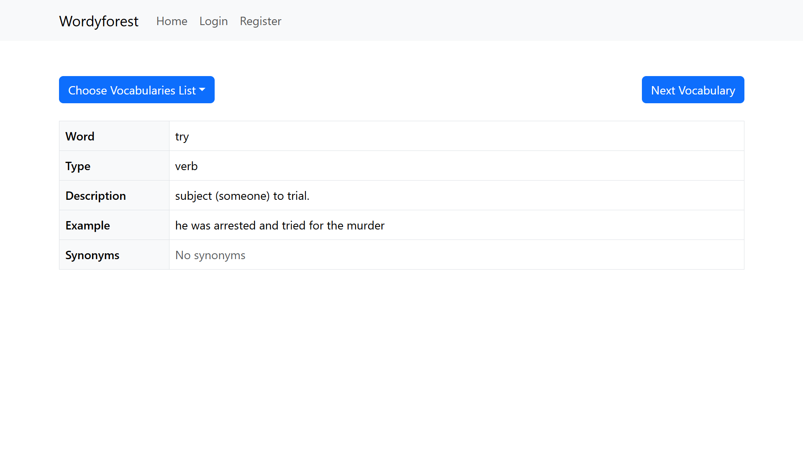
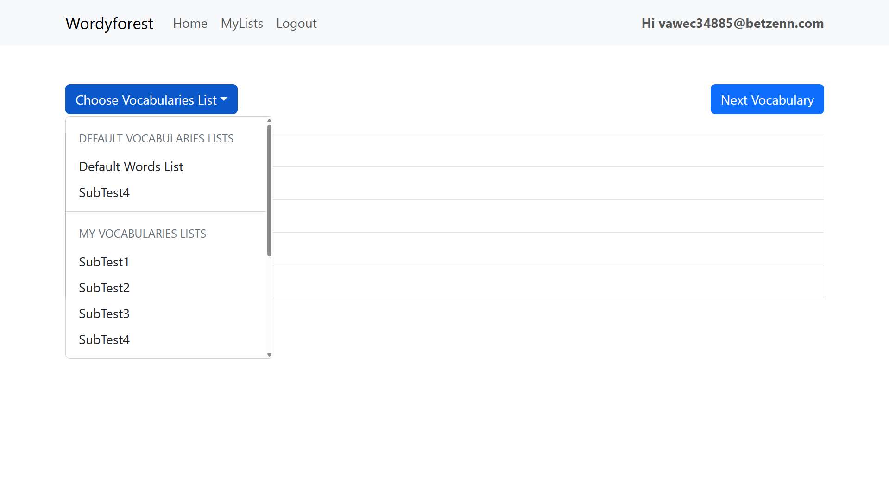
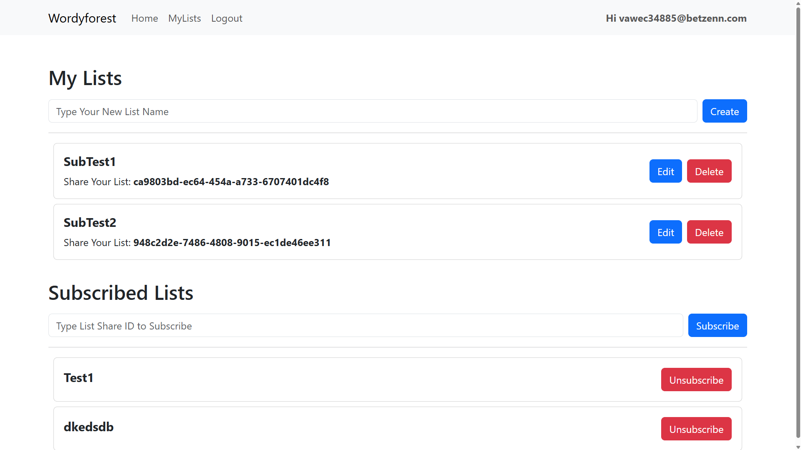
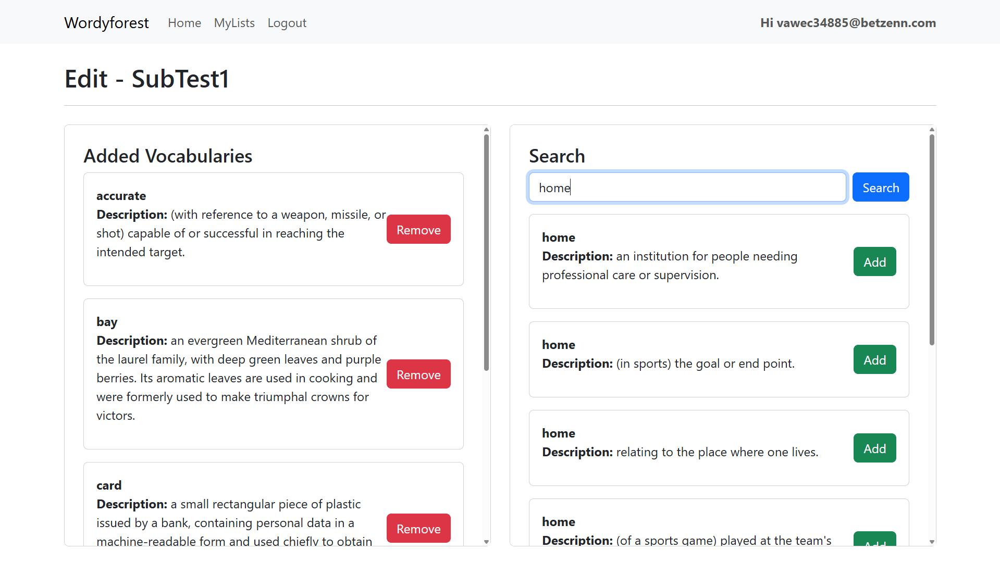

# Wordyforest Client

**Wordyforest Client** is the frontend of the
[WordyforestDotnet](https://github.com/cuberkam/WordyforestDotnet.git)
vocabulary learning platform. It allows users to discover and manage vocabulary
lists through an intuitive, responsive user interface. This application is built
with **React**, powered by **Vite**, styled using **Bootstrap**, and written in
**TypeScript**.

The app connects to a separate ASP.NET Core API backend and communicates via
secure JWT-based authentication.

## Screenshots

 
 

## Features

- **User Authentication**

  - Login & registration via JWT

- **Vocabulary List Management**

  - Create and manage personal vocabulary lists
  - Subscribe to lists created by others

- **Random Word Discovery**

  - Fetch and study random words from lists

- **Word Details**
  - View word type, meaning, examples, and synonyms

## Tech Stack

| Technology       | Description                           |
| ---------------- | ------------------------------------- |
| React            | UI library for building components    |
| Vite             | Lightning-fast development build tool |
| TypeScript       | Strongly typed JavaScript             |
| Bootstrap        | Responsive and consistent styling     |
| React Router DOM | Routing and navigation                |

## License

This project is licensed under the Apache License 2.0. See the LICENSE file for
details.
